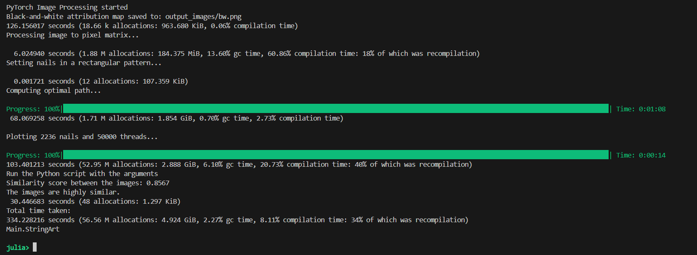

# StringArt.jl

A high-performance Julia project for the generation of StringArt, utilizing PyTorch for further image processing and evaluating.


## Algorithm

This project is composed of three main stages:

- 1. Load and process image data with PyTorch to create a heatmap of "importance" of each pixel.


- 2. Generate node connections and plot using julia


- 3. Compare similarity of output image with input image using PyTorch 




---
## Code
### Input Parameters

#### 1. Frame Type
- **Parameter**: `frame`
- **Type**: String
- **Options**: `"circle"` or `"rectangle"`
- **Description**: Defines the shape of the frame used in the computation. The algorithm can be extended to support other shapes if a function is implemented to determine nail coordinates.

#### 2. Iterations
- **Parameter**: `iterations`
- **Type**: Integer
- **Default**: `50000`
- **Description**: Determines the number of iterations for the algorithm. Higher values increase precision but also computation time.

#### 3. Nails
- **Parameter**: `nails`
- **Type**: Integer
- **Calculation**: `Int(round(sqrt(iterations) * 10))`
- **Description**: Specifies the number of nails used in the computation. A minimum of 250-300 nails is recommended, especially if the number of iterations is fixed.

#### 4. Overlay
- **Parameter**: `overlay`
- **Type**: Float
- **Calculation**: `500000 / iterations`
- **Description**: Controls the overlay effect. Lower values increase contrast, while higher values decrease it. Adjust based on the number of iterations.

#### 5. Line Thickness
- **Parameter**: `line_thickness`
- **Type**: Float
- **Calculation**: `300 / iterations`
- **Description**: Determines the thickness of the lines in the output. Adjust this value when changing the number of iterations. A minimum value of `0.025` is enforced to ensure visibility.

#### 6. Turbo
- **Parameter**: `turbo`
- **Type**: Integer
- **Calculation**: `Int(round(sqrt(nails / 2)))`
- **Description**: A factor that speeds up computation. If set too high, it may reduce precision.

#### 7. Step
- **Parameter**: `step`
- **Type**: Integer
- **Default**: `1`
- **Description**: Defines the line integral step. Decreasing this value increases precision but may also increase computation time.

#### 8. Update
- **Parameter**: `update`
- **Type**: Integer
- **Default**: `100`
- **Description**: Specifies how often the output is updated during processing, in terms of iterations.

#### 9. Pixel Matrix
- **Parameter**: `pixel_matrix`
- **Type**: Matrix{Float64}
- **Default**: `Matrix{Float64}(undef, 0, 0)`
- **Description**: A matrix to hold pixel data for processing.

#### 10. Processed Pixel Matrix
- **Parameter**: `pixel_matrix_processed`
- **Type**: Matrix{Float64}
- **Default**: `Matrix{Float64}(undef, 0, 0)`
- **Description**: A matrix to hold the processed pixel data.


## Types of Plots

The image processing algorithm can generate various types of plots based on the specified configurations. Below are the available plot types and their descriptions, along with the corresponding functions to call:

### 1. Quick Plot
- **Description**: Generates a quick visualization of the processed image using vector-based plotting. This method maintains sharpness and clarity when zooming in, as it recalculates the lines and shapes at a higher resolution. This is the quickest option for vector-based plotting.
- **Function**: `@time quick_plot(G, nodes_matrix, nail_connections)`

### 2. Threaded Plot
- **Description**: Similar to the quick plot, but utilizes threading to improve performance during rendering (is hardware dependent). This is beneficial for larger datasets where speed is a concern.
- **Function**: `@time threaded_plot(G, nodes_matrix, nail_connections)`

### 3. Makie Quick Plot
- **Description**: Utilizes the Makie library for high-performance plotting. This function is designed for quick visualizations with enhanced graphical capabilities. However, it uses raster graphics for image rendering, which may lose sharpness when zooming in, as it displays images as fixed pixel grids. Despite this, it is the quickest option for rendering images.
- **Function**: `@time makie_quick_plot(G, nodes_matrix, nail_connections)`

### 4. GIF Plot
- **Description**: Creates an animated GIF representation of the processing steps. This is useful for visualizing changes over iterations and can be shared easily.
- **Function**: `@time gif_plot(G, nodes_matrix, nail_connections)`

### 5. Plot with Updates
- **Description**: Generates a plot that updates in real-time as the algorithm processes the image. This is useful for monitoring progress during long computations.
- **Function**: `@time plot_with_updates(G, nodes_matrix, nail_connections)`

### Example Usage
To generate a plot, you can call one of the functions as follows:

@time quick_plot(G, nodes_matrix, nail_connections)


## Overview

- Julia 1.11.3 or later
- Python (optional, for PyCall) -> code also runs without Python modules
- A working internet connection to download packages

---

## Installation

1. *Clone this repository:*

```bash
git clone https://github.com/kmnif/StringArt.jl
cd StringArt.jl
